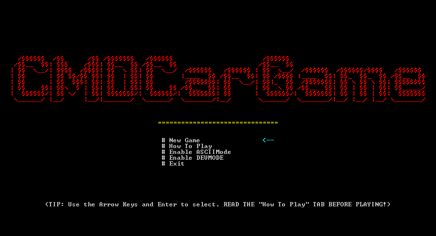
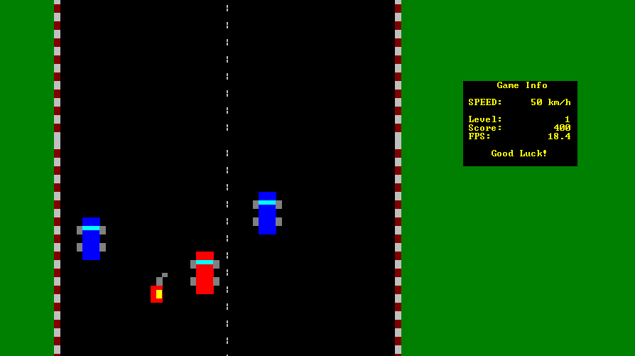

# CMDCarGame
Progetto di Programmazione Anno 2019/2020

Sviluppato da Angelo Galavotti, Adriano Pace, Denis Pondini.

## What is this?

Questa repo contiene il codice di CMDCarGame, il nostro progetto per il Corso di Programmazione all'Università di Bologna. 
Il gioco è un semplice gioco di macchine ispirato ai classici top-down di corse, come SpyHunter e Road Fighter. 
Abbiamo cercato di ricreare la grafica retro di questi, cercando di nascondere il più possibile il fatto che fosse un'applicazione che gira su terminale.
Inoltre, è facilmente estensibile e personalizzabile cambiando sprites, titolo e altro anche a run-time. 

C'è anche una modalità ASCII con grafica più leggera per i sistemi con CPU più vecchie o in generale terminali Windows meno ottimizzati. 

L'applicazione è compatibile unicamente con sistemi Windows. 

## How to Play:

Usare le frecce direzionali per muoversi. Per guadagnare punti raccogliere le taniche di benzina
ed evitare le pozzanghere (altrimenti vengono tolti 100 punti). Ogni volta che si raggiungono 1000 punti si raggiunge il livello successivo. Altrimenti, 
se il punteggio va sotto lo zero, si torna al livello precedente.

Se si colpisce una macchina, vengono tolti 1000 punti, e si passa automaticamente al livello precedente.
In caso il punteggio sia negativo quando si è al livello 1, il gioco si ferma e si arriva alla schermata di Game Over.

Se si vuole tornare al Menu principale mentre si gioca, per esempio per ricominciare la partita, basta premere il pulsante 'esc',
che permette immediatamente di arrivare alla schermata di Game Over e quindi di tornare al menu principale.

## How to Compile:

Si può compilare l'applicazione direttamente da CodeBlocks usando il file .cbp, oppure è possibile compilare e giocare direttamente dal Command Prompt di Windows, usando i comandi:

```
g++ -o Game.exe main.cpp
Game.exe
```

## Libraries:
Abbiamo usato unicamente `windows.h` per manipolare il terminale. 

## Screenshots:



